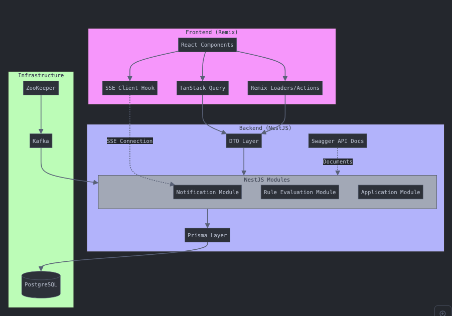
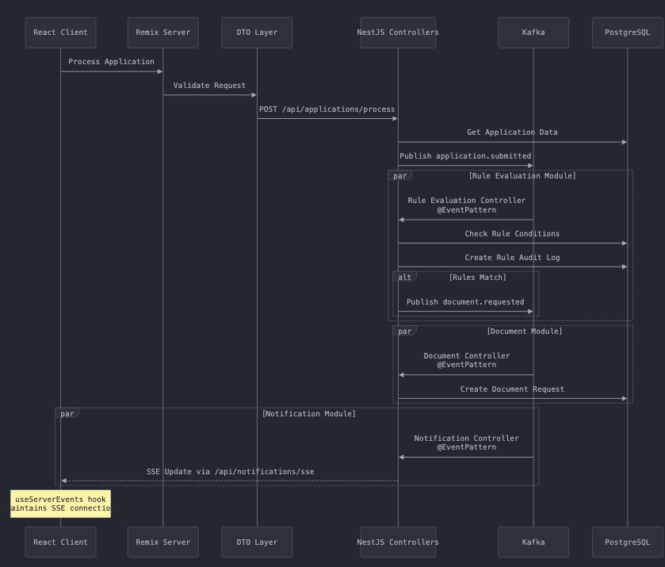

# Rule Engine POC Project

My approach to this project was to consider how to build a rule engine that allows for flexibility and scalability. I chose to use node-rules-json as a package for evaluating rules with a basic schema of `conditions` and `actions`. I considered that there may be different type of rules or ways of chaining rules that we would want to handle in the future so this POC distinguishes that there may be different types of rules like `RuleType.Application` or `RuleType.Payment`. Depending on the type of rule, the `RuleEvaluationService` can construct and resolve a flexible dictionary of facts to evaluate. The app uses Kafka and the `@EventPattern` decorator to listen to system events in sequence and in parallel and that each module in the NestJS app could be broken out into a standalone microserivce with relatively low overhead. This results in event-driven application that automates document requests (or any rule decided actions) based on application criteria. The architecture follows a clean separation of concerns between client/server and within server modules themselves but with shared type safety defined in the server.

## Running the app

1. Requirements [Docker](https://www.docker.com/products/docker-desktop/) and yarn: `npm install --global yarn` and { "node": "^20.0.0" }
2. `yarn run docker:dev`
3. Visit [localhost:3000](http://localhost:3000)
4. View API docs at [localhost:3000/api-docs](http://localhost:3000/api-docs)
5. Frontend available at [`/`](http://localhost:3000), API available at [`/api`](http://localhost:3000/api)
6. Demo and code walkthru videos:
   - [Demo: Part 1](https://www.loom.com/share/7b3be6d70ad14700a2e83293a18930f8)
   - [Part2](https://www.loom.com/share/17efcba839c640e598196a3b0d47d645)
   - [Part 3](https://www.loom.com/share/dbb5af6e297f4837878217a56d6c1391)

## Core Architecture

- **Frontend**: Remix/React application providing both server-side rendering and client-side interactivity. Forms using @conform-to/react (new library for me)
- **Backend**: NestJS organized into focused modules (Rule Evaluation, Document, Notification, Application, Rule Crud etc..)
- **Event Bus**: Kafka for decoupled, scalable processing
- **Real-time Updates**: Server-Sent Events (SSE)
- **Type Safety**: Shared DTOs across the stack and type generation with `swagger-typescript-api`

### System Overview

## Data Flow

When an application needs processing:

1. Frontend initiates the process through the API
2. Backend validates and processes the request through the DTO layer
3. An `application.submitted` event is published to Kafka
4. Multiple modules process this event concurrently:
   - Rule Evaluation Module checks conditions and logs audit trails
   - Document Module creates document requests when needed
   - Notification Module keeps clients updated in real-time via SSE

### Sequence Diagram

## Key Advantages

### Decoupled Processing

Using Kafka allows each module to process events independently, improving system resilience and scalability

### Real-time Updates

SSE provides efficient one-way communication for instant client updates

### Type Safety

Shared DTOs ensure consistent data structures across the stack

### Audit Trail

Rule evaluations are persisted for transparency and debugging

### Event Sourcing

Kafka provides an event log that could be used for replay and system recovery

## Future Considerations

### Testing & Error handling

- Did not get to this but I generally prefer to get as much coverage as possible with Cypress E2E testing and then follow on with unit tests and isolated api testing
- With nest, I generally like to implement catch all error filter and also implemented a @TryCatch decorator which logs and optionally re-throws but a I would be more granular given the time

### Enhanced Rule Engine

- Support for different rule types beyond document requests
- More complex rule conditions and combinations

### Microservices Evolution

- Split Rule Evaluation into its own microservice
- Dedicated Notification service for handling different notification types
- Each service would maintain its own database while sharing the Kafka broker

### Scalability Improvements

- Kafka partitioning for parallel processing
- Horizontal scaling of individual services

### Observability

- Centralized logging
- Performance metrics
- tracing

I'm somewhat new to event-driven architecture so this was a good learning opportunity that raised some good question. Having discussed that I'd previously worked on a Rule engine project, there are several patterns here that would have greatly improved scalability and resilience in the previous project.
